# Developing ProtoSchool Tutorials

This guide will introduce you to the process of building a ProtoSchool tutorial. It covers the steps you'll need to take to build the files that create your lessons, using the platform we've built in VueJS.

**Before you get started here, please be sure to read our documentation on [Designing Tutorials](DESIGNING_TUTORIALS.md) in its entirety.** There you'll learn about the process for proposing and outlining a new tutorial with community input, as well as some of the key elements of an effective learning experience.

**Before you start building your tutorial, you should have an open issue in this repo with your proposal/outline, with feedback and approval from the ProtoSchool team.**

Ready to get started? Read on!

---

**Table of Contents**

<!-- To update this table of contents to match level 2-6 headings, run `npm run build:docs:develop` -->
<!-- This command will be run and updates saved automatically before any commit. -->

<!-- toc -->

- [Developing Tutorials](#developing-tutorials)
  * [Run the server locally to preview your work](#run-the-server-locally-to-preview-your-work)
  * [Create files and metadata](#create-files-and-metadata)
    + [Using the ProtoWizard CLI (recommended)](#using-the-protowizard-cli-recommended)
      - [Install and launch the ProtoWizard](#install-and-launch-the-protowizard)
      - [Use the ProtoWizard to create starter files and metadata](#use-the-protowizard-to-create-starter-files-and-metadata)
    + [Manually](#manually)
      - [Create a directory for your tutorial](#create-a-directory-for-your-tutorial)
      - [Create lesson files](#create-lesson-files)
        * [Lesson text file (all lesson types)](#lesson-text-file-all-lesson-types)
        * [JavaScript file (skip for text-only lessons)](#javascript-file-skip-for-text-only-lessons)
        * [Challenge text file (skip for text-only and multiple-choice lessons)](#challenge-text-file-skip-for-text-only-and-multiple-choice-lessons)
        * [Useful concepts text file (optional)](#useful-concepts-text-file-optional)
      - [Manage your tutorial's metadata](#manage-your-tutorials-metadata)
        * [Add your tutorial to `static/tutorials.json`](#add-your-tutorial-to-statictutorialsjson)
        * [Add resources](#add-resources)
        * [Add alert messages for new and updated tutorials (optional)](#add-alert-messages-for-new-and-updated-tutorials-optional)
        * [Add your tutorial to `static/courses.json`](#add-your-tutorial-to-staticcoursesjson)
  * [Create your lesson content](#create-your-lesson-content)
    + [Write the text of your lesson (all lesson types)](#write-the-text-of-your-lesson-all-lesson-types)
      - [Add images to your lesson (optional)](#add-images-to-your-lesson-optional)
    + [Create multiple-choice quizzes (skip for coding challenges and text-only lessons)](#create-multiple-choice-quizzes-skip-for-coding-challenges-and-text-only-lessons)
    + [Build code challenges and validation (skip for text-only and multiple-choice lessons)](#build-code-challenges-and-validation-skip-for-text-only-and-multiple-choice-lessons)
      - [Describe the challenge](#describe-the-challenge)
      - [Provide the starting code for your challenge](#provide-the-starting-code-for-your-challenge)
      - [Provide the simplest solution to your challenge](#provide-the-simplest-solution-to-your-challenge)
      - [Validate the user's submitted code](#validate-the-users-submitted-code)
        * [Work with uploaded files (for code challenges with file upload only)](#work-with-uploaded-files-for-code-challenges-with-file-upload-only)
        * [Create success and failure messages](#create-success-and-failure-messages)
        * [Utils module](#utils-module)
        * [Override external error messages (optional)](#override-external-error-messages-optional)
        * [Display results to the user (optional)](#display-results-to-the-user-optional)
  * [Submit a pull request](#submit-a-pull-request)
- [Troubleshooting](#troubleshooting)
  * [Clearing cached data from localStorage](#clearing-cached-data-from-localstorage)
  * [Renaming a tutorial after it has been published](#renaming-a-tutorial-after-it-has-been-published)
  * [Text of lesson or challenge not displayed](#text-of-lesson-or-challenge-not-displayed)
- [Detailed Docs](#detailed-docs)
  * [Lesson file](#lesson-file)
  * [`utils` module](#utils-module)
    + [`utils.format`](#utilsformat)
    + [`utils.ipfs`](#utilsipfs)
    + [`utils.validationMessages`](#utilsvalidationmessages)
    + [`utils.validators`](#utilsvalidators)
- [License](#license)

<!-- tocstop -->

---

## Developing Tutorials

Each **tutorial** in ProtoSchool is made up of multiple **lessons**. Before you get started, think about the type of lessons you'd like to include.

There are four lesson formats available, which you may mix and match within your tutorial:
- A standard lesson with a JavaScript coding challenge (the most common)
- A lesson with a JavaScript coding challenge that requires a file upload
- A text-only lesson with no code challenge
- A lesson that concludes with a multiple-choice quiz

To build any of these lesson types, you'll need to use Markdown, a fairly simple way to style text on the web. [Learn more about Markdown formatting here.](https://guides.github.com/features/mastering-markdown/)

To create text-based or multiple-choice lessons, no prior coding knowledge is required, as the content of these lessons is written in Markdown. To create the question and answer choices for a multiple-choice quiz, you can either use the ProtoWizard or make some text edits to the provided JavaScript template.

However, if you want to create code challenges (with or without file upload), you'll need to use JavaScript extensively to set up your default and solution code and validation. JavaScript is a scripting language for building interactive web pages, and you should have a solid understanding of JavaScript before building a code challenge for ProtoSchool.

Ready to get started? Let's create a tutorial!


### Run the server locally to preview your work

1. [Clone this repository](https://help.github.com/en/github/creating-cloning-and-archiving-repositories/cloning-a-repository) to your computer:

```sh
$ git clone https://github.com/ProtoSchool/protoschool.github.io.git
```

2. Change into the new directory created:

```sh
$ cd protoschool.github.io
```

3. Check out the appropriate branch:

If creating a new tutorial, create a new branch before making any changes, starting with our current website code (the `main` branch):

```sh
$ git checkout main
$ git checkout -b new-branch-name
```
If proofing a PR for someone else, check out their branch (you'll see its name listed in the PR):

```sh
$ git checkout existing-branch-name
```

4. Install dependencies using NPM:

```sh
$ npm install

```

5. Run the dev server locally:

```sh
$ npm start
```

6. Open a web browser to the following address to preview your work: http://localhost:3000

Vue will update your localhost preview automatically as you make changes.


### Create files and metadata

Before you create the content of your tutorial, you'll need to set up a directory, lesson files, and metadata. You can do this quickly and intuitively with the help of our user-friendly ProtoWizard.

We've included instructions in this guide for doing all of this manually (in case you're curious or ambitious or need to make some changes after the fact), but we strongly recommend that you use the ProtoWizard to skip all of that manual grunt work. This approach will let you focus on the most important stuff, which is creating the content of your tutorial -- explaining concepts, creating code challenges or multiple-choice quizzes, etc.

#### Using the ProtoWizard CLI (recommended)

The ProtoWizard is a CLI (Command-Line Interface) that makes it easy to create the starter files and metadata needed for a new tutorial. You can build your full tutorial at once, creating your tutorial metadata (URL, description, etc.), lesson files, and resources in one go. Alternatively, you can create your tutorial framework and then come back to add lessons and resources as you're ready. You can even summon the ProtoWizard to build the quizzes for your multiple-choice lessons.

It's easy to use the ProtoWizard even if you're not familiar with the command line. It will ask you a few questions and let you type your answers or select options using arrow keys. Based on your answers, the ProtoWizard will build the directory, files, and metadata you'll need to create your tutorial.

_Note: ProtoWizard requires Node.js version 10 or higher. You can acquire the latest LTS (long-term support) version on the [Node download page](https://nodejs.org/en/download/)._

##### Install and launch the ProtoWizard

After following the steps above to create a new branch and run the server locally, open a new terminal window or tab displaying the same directory. You'll use the ProtoWizard in this tab while the other keeps your server running.

Because you're likely to want to run the ProtoWizard multiple times, we recommend installing it so you can use a more memorable shortcut command to run it whenever you'd like.

First, install the wizard:
```sh
$ npm run install-protowizard
```

Once the wizard is installed, you'll be able to summon it repeatedly with the shortcut command:
```sh
$ protowizard
```

If you choose not to install it, you'll need to use this longer command to summon the ProtoWizard:
```sh
$ npm run scripts:wizard
```

_Note: The ProtoWizard terminates automatically when you're done responding to its questions. You can exit the ProtoWizard prematurely using `Ctrl-C`._


##### Use the ProtoWizard to create starter files and metadata

When you run either of the commands above to start the CLI, our friendly little ProtoWizard will appear to help you:

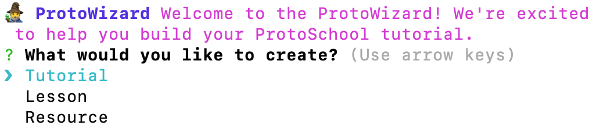

If you're creating a new tutorial from scratch, you'll need to create a tutorial before adding lessons or resources to it. You can either add your lessons and resources immediately after creating the tutorial or exit the ProtoWizard and run it again later to create those items. To create a multiple-choice quiz, you'll need to have first created your tutorial and lesson files.

By keeping your server running, you can preview your new tutorial in a web browser while using the ProtoWizard to add content.

**Tutorial**

Answer a few quick questions about your tutorial and the ProtoWizard will use your responses to set up both a directory for your tutorial (eg `src/tutorials/0007-my-new-tutorial`) and the necessary metadata (title, description, etc.) to display the tutorial on our website. When finished, the ProtoWizard will let you know where to go to preview your new tutorial in your web browser.

While the ProtoWizard only supports the initial creation of this data, you can edit the details later in `src/static/tutorials.json`. If you need to do this, please read [Manage Your Tutorial's Metadata](#manage-your-tutorials-metadata) for more information.

**Lessons**

Tell the ProtoWizard the name of your lesson and its type (text-only, multiple-choice, coding challenge with or without file upload) and it will create all the starter files you need inside your tutorial's directory. ([Learn more about the files required for each lesson type.](#create-lesson-files)) The ProtoWizard will provide you with the names of the files it's created so you'll know where to go to make your edits.

If you have a solid outline, you can create these files all at once before editing them to create your content. Alternatively, you can set up just the files for your first lesson, build out that content to get familiar with the process, and summon the ProtoWizard again later to create your next set of files. It's up to you.

This guide includes detailed instructions on how to work within those files to [create your lesson content](#create-your-lesson-content) when you're ready.

**Resources**

Each ProtoSchool tutorial ends with a resources page where you can share suggestions of other learning materials relevant to your learners. The ProtoWizard will ask you a few quick questions about each resource in order to add the necessary details your tutorial's metadata. You can add all of your entries at once or come summon the ProtoWizard repeatedly as you think of more resources.

If you'd like to make edits to the resources you've created through the ProtoWizard, you can edit the details later in `src/static/tutorials.json`. [Learn how to create or edit resources manually.](#manage-your-tutorials-metadata)

**Multiple-choice quizzes**

Each multiple-choice lesson ends with a quiz to reinforce the lesson content. With the help of the ProtoWizard, you'll draft the question the learner needs to answer, then provide answer choices and feedback positive or negative feedback to display when each option is selected.

The ProtoWizard will provide you with a link to the updated quiz file so you can make further edits as needed, or you can summon the ProtoWizard again to start from scratch and overwrite the quiz content. [Learn how to create or edit quizzes manually.](#create-multiple-choice-quizzes-skip-for-coding-challenges-and-text-only-lessons)

#### Manually

This section describes how to build the directory, lesson files, and metadata for your tutorial manually if you've chosen not to use the recommended ProtoWizard. If you've used the [ProtoWizard](#using-the-protowizard-cli-recommended) to create your tutorial, lesson files, and resources, please skip to [Create Your Lesson Content](#create-your-lesson-content).

##### Create a directory for your tutorial

Each tutorial in ProtoSchool has a 4-digit ID and a corresponding directory. To determine the right ID for your new tutorial, first navigate to the `src/tutorials` directory and list its contents:


```sh
$ cd src/tutorials
$ ls
0001-data-structures
0002-basics
0003-blog
0004-mutable-file-system
boilerplates
```
The number used as your tutorial's ID and directory name should be one higher than the last numbered directory you see listed. (In the example above, seeing that `0004-*` is the last numbered directory, you would create a new directory called `0005-tutorial-short-title`, where the text after the id will be the identifier on the tutorial URL. More on this ahead!)

Create a directory with the appropriate ID, for example:

```sh
$ mkdir 0005-tutorial-short-title
```

##### Create lesson files

Each **tutorial** in ProtoSchool is made up of multiple **lessons**.

Currently there are four lesson formats available, which you may mix and match within your tutorial:
- A standard lesson with a coding challenge (the most common)
- A lesson with a coding challenge that requires a file upload
- A text-only lesson with no code challenge
- A lesson that concludes with a multiple-choice quiz

Depending on which lesson format you've chosen, you'll need to create 2-4 files within your project directory. Check the table below to see which files you need, then read on for instructions on how to create them.

| File | Sample Filename | Standard Lesson with Coding Challenge | Lesson with Coding Challenge and File Upload | Multiple-Choice Lesson | Text-Only Lesson |
| :---  | ---- | ---- | ---- | ---- | ---- |
| A JavaScript file that provides **required metadata** (e.g. code) for your lesson and, when relevant, the **default code and validation for a coding challenge** or **answer selections for multiple-choice quizzes** |`01.js`| Required | Required | Required | Not Used |
| A markdown file containing the **text of the lesson** (your educational content)|`01.md`| Required | Required | Required | Required |
| A Markdown file containing the **text of the assignment shown in the challenge box**|`01-challenge.md`| Required | Required | Not Used | Not Used |
| A Markdown file containing the **text of the optional useful concepts box**|`01-concepts.md`| Optional | Optional | Optional | Optional |

In the example below, four files stored in the `tutorials/0005-tutorial-short-title` directory work together to create the second lesson in that tutorial.

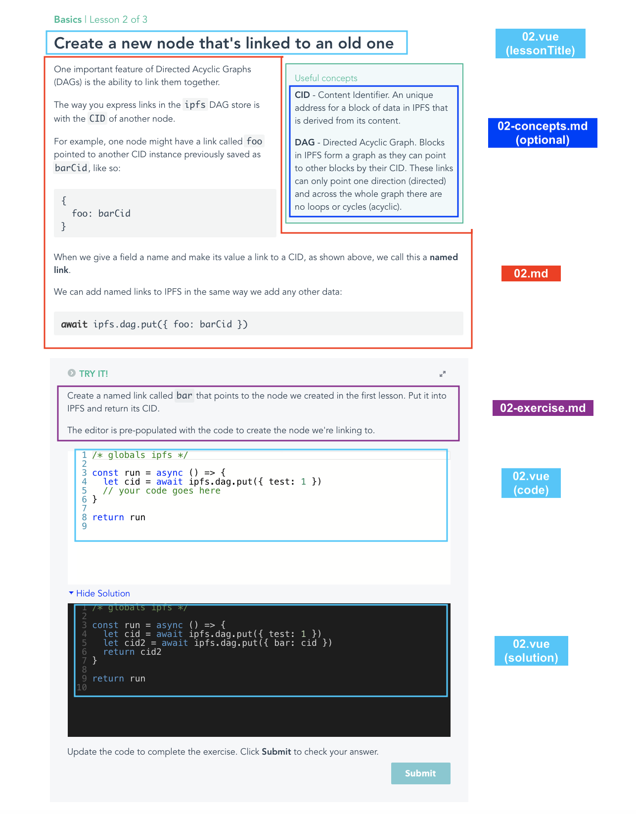

###### Lesson text file (all lesson types)

Create a Markdown file by copying the `boilerplate.md` file provided. The name of this file should be the 2-digit lesson number.

For example (for Lesson 01 of Tutorial 0005):

```sh
$ cp boilerplates/boilerplate.md 0005-tutorial-short-title/01.md
```

Use this file to draft the text of your lesson (the educational content), as described later in [these instructions](#write-the-text-of-your-lesson-all-lesson-types).

###### JavaScript file (skip for text-only lessons)

Select the appropriate boilerplate JavaScript file for your lesson from the `src/tutorials/boilerplates` directory:

- `boilerplate-code.js` for a lesson with a coding challenge which does not require a file upload
- `boilerplate-file-upload.js` for a lesson with a coding challenge that requires a file upload
- `boilerplate-multiple-choice.js` for a lesson with a multiple-choice quiz

Copy that boilerplate into the tutorial directory you created earlier (e.g. `0005-tutorial-short-title`) and rename it to the 2-digit number of the lesson.

For example, to create a JavaScript file for a standard coding challenge as Lesson 01 of Tutorial 0005 (while still in `src/tutorials`):

```sh
$ cp boilerplates/boilerplate-code.js 0005-tutorial-short-title/01.js
```

Use this file to set up your default code and validation or your multiple-choice quiz, as described later in [these instructions](#create-multiple-choice-quizzes-skip-for-coding-challenges-and-text-only-lessons).

###### Challenge text file (skip for text-only and multiple-choice lessons)

If your lesson includes a coding challenge, create a second `.md` file using the `boilerplate-challenge.md` file. The name of this file should match the 2-digit lesson number used previously, with `-challenge` appended.

For example (for Lesson 01 of Tutorial 0005):

```sh
$ cp boilerplates/boilerplate-challenge.md 0005-tutorial-short-title/01-challenge.md
```

###### Useful concepts text file (optional)

Occasionally you may want to add a _useful concepts_ box defining key terminology, if this can't easily be done in-line. If you'd like to do this, create another `.md` file that provides the text for that _useful concepts_ box. The name of this file should match the 2-digit lesson number used previously, with `-concepts` appended. (This step is optional.)

For example (for Lesson 01 of Tutorial 0005):

```
src/tutorials/0005-tutorial-short-title/01-concepts.md
```

##### Manage your tutorial's metadata

There are a few administrative steps you need to take to ensure that all of your lessons appear on our site, along with a landing page and resources page.

###### Add your tutorial to `static/tutorials.json`

In `static/tutorials.json`, add a new key for your tutorial and fill in the appropriate values, as in the example below.

```json
"0005": {
  "url": "tutorial-short-title",
  "redirectUrls": [],
  "project": "ipfs",
  "title": "Your short tutorial title",
  "description": "Your tutorial description",
  "resources": [
    {
      "title": "Video title",
      "link": "https://youtu.be/videoid",
      "type": "video",
      "description": "Description of video"
    },
    {
      "title": "Documentation 1",
      "link": "https://docs.domain.io",
      "type": "docs"
    }
  ],
  "updateMessage": "",
  "newMessage": "",
  "createdAt": "2020-01-01T00:00:00.000Z",
  "updatedAt": "2020-01-01T00:00:00.000Z"
},
```

The _key_ must match your tutorial's ID and the name of the directory where you've been creating your files.

The `title` of your tutorial will be seen in course listings on our tutorials page, your tutorial's table of contents, and anywhere else your tutorial is featured.

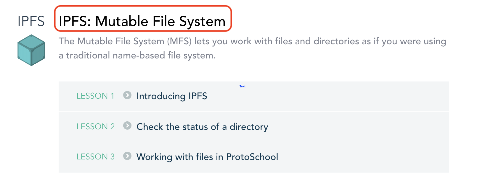

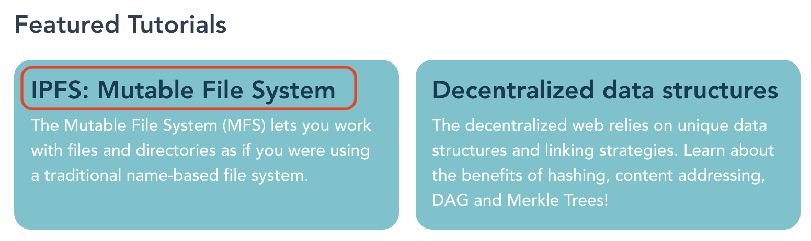

The `url` will appear in the URL of your tutorial landing page and lessons. For example,  `http://proto.school/short-tutorial-title/01`. In most cases this will match your tutorial title, but you may find that you need to make it shorter. Note that this URL will also be used to create the abbreviated title that is shown in the breadcrumb navigation and the small header at the top of each page of your tutorial.

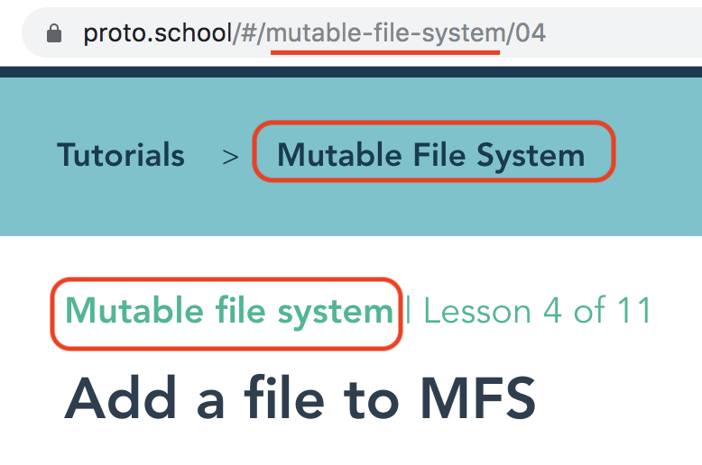

Pay special attention to the `resources` array shown above, which will be used to create a pre-styled `Resources` page at the end of your tutorial. [Learn more about adding these mandatory resources.](#add-resources)

The properties `updateMessage`, `newMessage`, `createdAt` and `updatedAt` are used to alert users to new tutorials or tutorials that have been updated since they last visited them. When creating a new tutorial, both the `createdAt` and `updatedAt` fields should be set to the date you're submitting your pull request. [Learn more about new and updated tutorial alerts and how you can customize them.](#add-alert-messages-for-new-and-updated-tutorials-optional)


###### Add resources

The `resources` array in your tutorial's metadata is used to create a pre-styled `Resources` page at the end of your tutorial. Each object in this array represents one recommended resource, and should include a `title`, `link`, `type` (which appears as a tag), and optional `description` of that resource. The details you provide will be automatically populated into your `Resources` lesson, as in the example below:

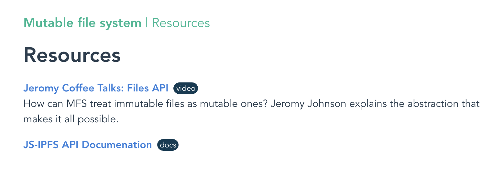

Examples of meaningful resource `type`s include: `docs`, `demo`, `tutorial`, `article`, `video`, and `website`.

Be sure to include any ProtoSchool tutorials that would provide a nice follow-on to your own content. Be sure to use the type `tutorial` for these, and they will automagically receive an extra callout as ProtoSchool tutorials when the page renders, like so:

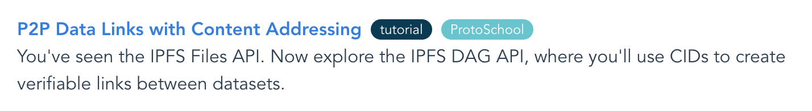


###### Add alert messages for new and updated tutorials (optional)

**When a new tutorial is published**, a new tutorial alert will be displayed for one month. This message disappears when a user has completed the tutorial (or some of it) or when a month has passed since the `createdAt` date, whichever comes sooner. You can _optionally_ display a custom message within the new tutorial alert by updating the `newMessage` field in `tutorials.json`, using markdown formatting within the message as needed.

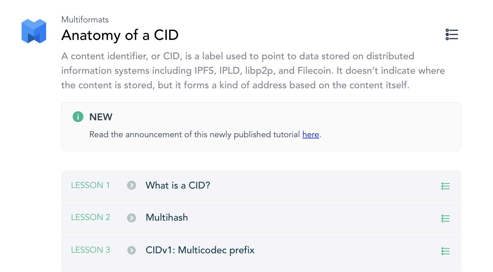

**When major updates are made to an existing tutorial**, an update alert will be displayed to users who have previously completed at least one lesson within the tutorial. Major changes include those that change solution code or fundamentally alter the concepts being taught. If a user were to return to a lesson in your tutorial and find that their old solution no longer passed the lesson, that would be an indicator that you've made a major change that requires an alert. Simple typo fixes, addition of graphics, etc., do not count as major updates.

When submitting a PR that includes major tutorial updates, you should provide an `updateMessage` in `tutorials.json` that calls out what's changed, using markdown formatting as needed, and adjust the `updatedAt` field accordingly. This date will be compared to the date at which a user last completed a lesson to determine whether the message should be displayed. If displayed, the update message will disappear once a user has completed the updated version of the tutorial. Users who haven't visited a tutorial before its `updatedAt` date will never see the message.

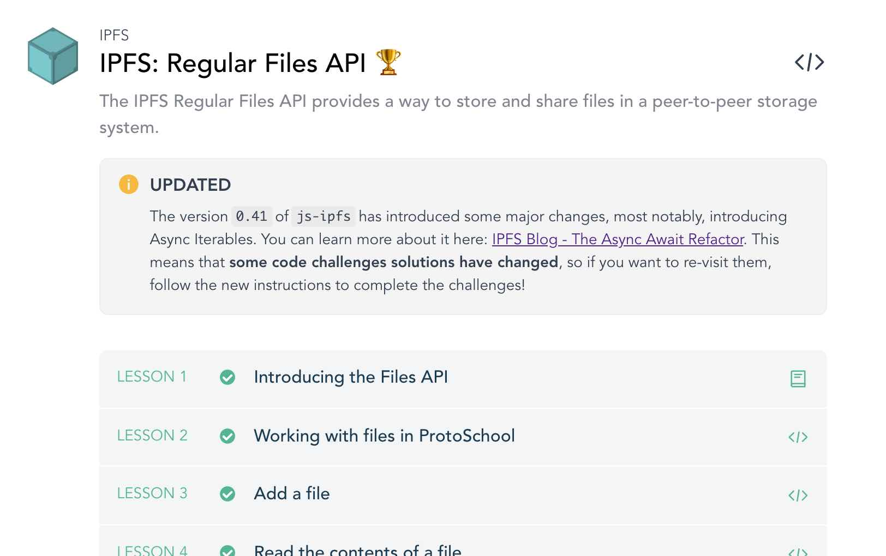

###### Add your tutorial to `static/courses.json`

In `static/courses.json`, add the tutorial key that you used in `static/tutorials.json` to the `all` array so it will appear in the Tutorials page. For example, to continue with the same example shown above, you would make this change:

```diff
{
  "all": [
    "0001",
    "0002",
    "0003",
+   "0005"
  ],
  "featured": [
    "0001",
    "0002",
    "0003"
  ]
}
```

The project maintainers will take care of making any updates needed to ensure your project is featured in any relevant course listings elsewhere on our site.


### Create your lesson content

Once you've created the boilerplate files and metadata needed to build your tutorial, you can start customizing your lesson content. The steps you take will depend on your lesson type.

#### Write the text of your lesson (all lesson types)

Use your lesson Markdown file (e.g. `01.md`) to type the text of your lesson in Markdown format.

Not familiar with Markdown? It's a fairly simple way to style text on the web. [Learn more about Markdown formatting here.](https://guides.github.com/features/mastering-markdown/) There are some formatting hints provided for you in the boilerplate, including how to create section headers or links if needed.

Note that your lesson title will appear on its own. You should not repeat it at the top of this file.

##### Add images to your lesson (optional)

If you want to add images to your Markdown file, place them in the `public/tutorial-assets` directory, with the following naming convention:

`T<4-digit-tutorial-id>L<2-digit-lesson-number>-<imageName>`, such as `T0001L05-diagram.svg`.

Then in your lesson Markdown file, you can either add the image with regular Markdown:

```

```

...or with regular HTML, if you need to set the image size:

```html

```


#### Create multiple-choice quizzes (skip for coding challenges and text-only lessons)

We recommend that you [use the ProtoWizard to create your multiple-choice quizzes](#using-the-protowizard-cli-recommended).

However, you may instead choose to edit your JavaScript (eg `01.js`) file directly to define the question and its answer choices, as described below.

When editing manually, please be sure to remove the following line of code:
```
// #PRISTINE# This file was auto-generated. Please remove this line when updating the file manually.
```
This will allow the ProtoWizard to identify the file as having been edited, so that it can warn you if you later ask to overwrite existing content.

The `question` value must be a string:

```js
const question = "What's the meaning of life, the universe, and everything?"
```

 The `choices` variable must be an array of objects, one for each answer the learner may select. Each object in the array must contain three keys and their respective values:
 - `answer` (a string)
 - `correct` (a boolean: `true` if the answer is correct and `false` if it's wrong)
 - `feedback` (a string displaying a helpful error message for a wrong answer or a congratulatory message for a correct answer)

```js
 const choices = [
   {
     answer: "An incorrect answer",
     correct: false,
     feedback: "Oops. Here's some clue about why that answer is wrong."
   },
   {
     answer: "A correct answer.",
     correct: true,
     feedback: "Great job!"
   },
   {
     answer: "A different incorrect answer",
     correct: false,
     feedback: "Sorry, here's some clue about why this choice is wrong."
   }
 ]
```

Please provide 3-5 answer choices per question. **You may only provide _one_ correct choice.**

If you create the quiz manually, the answer choices will be presented in the order in which you list them. Be sure to vary the position of the correct answer from lesson to lesson. (When using the ProtoWizard, your choices will be shuffled automatically.)

The `feedback` provided for each choice will be shown highlighted in red if incorrect or in green if correct, and the user will be able to advance to next lesson once they've made the right selection.

#### Build code challenges and validation (skip for text-only and multiple-choice lessons)

If you are creating a lesson with a code challenge (whether or not it requires file upload), you'll need to provide default code and set up validation in the lesson's JavaScript file (eg `01.js`). The basic template you need to accomplish this is provided in the boilerplate file you created earlier. You'll also need to provide instructions for the challenge in your challenge Markdown file (eg `01-challenge.md`).

##### Describe the challenge

In your challenge Markdown file (eg `01-challenge.md`) add the markdown-formatted text that provides the assignment text for the challenge box. ([Learn more about Markdown formatting here.](https://guides.github.com/features/mastering-markdown/))

Be sure to describe the challenge clearly and concisely. For example:

```md
Use `ipfs.dag.put` to create a node for the data `{ test: 1 }`. Return the CID of your new node.
```

Be sure that the challenge tests the learner's understanding of the concept you're teaching, not of JavaScript itself. If they'll need to use a specific JavaScript method that might be unfamiliar to newer coders, consider adding a hint with links to learn more about the method. For example:

```md
**Hint**: Try the [`map`](https://developer.mozilla.org/en-US/docs/Web/JavaScript/Reference/Global_Objects/Array/map) or [`forEach`](https://developer.mozilla.org/en-US/docs/Web/JavaScript/Reference/Global_Objects/Array/forEach) array methods to loop through each file in the `files` array and access its name as `file.name`.
```

##### Provide the starting code for your challenge

You'll use your JavaScript file (eg `01.js`) to build the code challenge and validation using JavaScript.

`code` is a string property. The value you set for `code` in your JavaScript file will
be used to populate the code editor when the user first visits the page. (If you forget to set this, a default will be used, but your challenge won't be very useful!)

```js
const code = `const run = async () => {
  /* your code here */
}
return run
`
```

Your default `code` will always have this exterior `run` function, inside of which
your user creates their own code. The code your user writes will almost always
include returning a value from the interior function.

As you decide what starting code to provide for each lesson, think about how you
can isolate the action the user needs to take to a single step, representing the
concept they've learned in this particular lesson.

In practice, most lessons build off of previous ones, and code is repeated and
built on between challenges. You will often need to pre-populate in your lesson the
correct solution to a previous lesson or lessons, so that the current challenge can
test adding only the most recent method taught.

You should also think about how you might provide support for programming language
challenges and limit the assignment to executing methods that practice your lesson
content.

Remember that you can add comments to your default code to orient the user, such as:

```js
// your code goes here
```

##### Provide the simplest solution to your challenge

`solution` is a string property. The value you set for `solution` in your JavaScript
file will be used to populate the code editor if the user clicks the "View
Solution" option. (We hope you'll have provided enough clues that they won't need to do this!)

Be sure to test your solution code. If the user clicks "View Solution" and then "Submit", they should see your success message.

There's almost always more than one way to solve a coding challenge. Although your
validation code (see below) should allow all reasonable solutions to pass, the
`solution` code you provide should be the most straightforward option which
requires the least thorough understanding of JavaScript.

##### Validate the user's submitted code

Feedback is key to a positive learning experience. As the author of a tutorial, you'll need to give careful thought both to how you'll verify that your user has submitted successful code and to what mistakes they might make along the way. It's your responsibility to anticipate challenges and provide helpful clues accordingly.

To do this, you'll use the `validate` function found in the boilerplate, which takes this format:

`validate(result, ipfs)`

When the sample code area is evaluated, it must return a function, usually an
async function. The result of that function is passed to your validation
function as `result`.

Each time the user's code is evaluated, they get a new, clean, IPFS instance.
That instance is passed as the second argument, `ipfs`.

You may want to use both the `result` and `ipfs` values when building conditional statements to evaluate the success or failure of the user's code submission. If needed, check out this primer on [using conditionals in JavaScript](https://developer.mozilla.org/en-US/docs/Learn/JavaScript/Building_blocks/conditionals).

###### Work with uploaded files (for code challenges with file upload only)

By using the lesson type `file-upload`, which comes included in the `boilerplate-file-upload.js` template, you can create a lesson which requires the user to upload files before completing a code challenge.

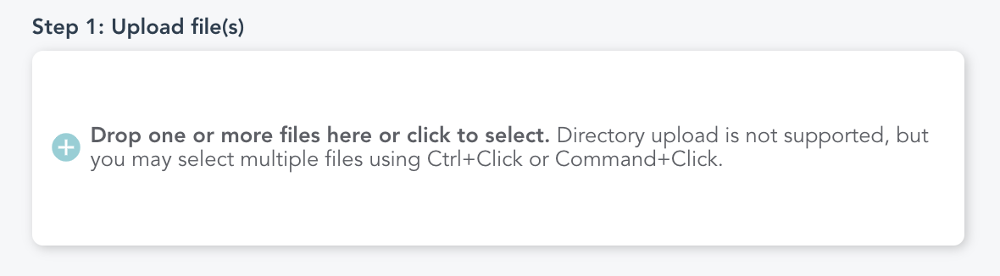

The `run` function in the code challenge takes an argument `files`, which is the array of uploaded files.

```js
const run = async (files) => {
  /* remove the '//' on the line below to complete this challenge */
}
```

Behind the scenes, the uploaded files have been saved as `window.uploadedFiles` for use both in your user's code and in your own validation. In your `validate` function, we recommend saving the files to a variable and allowing for the fact that they may not be present. For example:

```js
const uploadedFiles = window.uploadedFiles || []
```

Remember that these files are stored as browser file objects. Reference the [Files documentation](https://developer.mozilla.org/en-US/docs/Web/API/File#Properties) to see what properties are available to both you and the user, including `name` and `type`.

If the user proceeds to the next lesson without refreshing their browser, the same files will remain available to them. However, they may also choose to click "Start Over" and upload different files. The user will be unable to click "Submit" until files have either been selected from their machine or carried over from a previous lesson.

###### Create success and failure messages

Your `validate` function must return an object with one of two properties: `fail` or
`success`. Each property should be used to give a detailed message (as a string) either congratulating the user or explaining *why* the sample code failed in order to help the user along.

```js
const validate = async (result, ipfs) => {
  if (!result) {
    return { fail: 'You forgot to return a result :)' }
  } else if (result) {
    return { success: 'Happy Message!' }
  } else {
    return { fail: 'Sad but useful message :(' }
  }
}
```

Be sure to include conditionals that will catch common mistakes and provide useful clues.

The [`utils` module](#utils-module-1) has some pre-built validators ([`utils.valitors.*`](#utilsvalidators)) that you can re-use across lessons and tutorials. For more advanced cases related to IPFS errors, you can also use the [`utils.ipfs`](#utilsipfs) module where `utils.ipfs.errorCodes` might be useful.

If the object returned by your `validate` function has the property `fail`, the message string you've provided will be shown highlighted in red, and the user will have the opportunity to update and resubmit their code. If it has the property `success`, the user will see the success message highlighted in green, and the "Submit" button will change into a "Next" button allowing them to advance to the next lesson.

You may (optionally) use [markdown formatting](https://guides.github.com/features/mastering-markdown/) in your `fail` or `success` messages. For example, the following validation code:

```js
} else if (result && !result.cid) {
  return { fail: "That result doesn't look right. Are you sure you ran the `stat` method on your empty root directory?" }
}
```

...would produce this user-facing message:


If this is the last lesson in your tutorial, please create a success message that notes that the user has completed the whole tutorial. For example, `Great job! You've completed this series of lessons!`)

There are some pre-built messages that you can use if you'd like by using the [`utils.validationMessages` module](#utilsvalidationmessages).

###### Utils module

There are some utils that you can use across lesson code validations. For that you can use the `utils` module:

- `utils.format`: format specific objects, such as `ipfs` objects
- `utils.ipfs`: IPFS-specific helpers. Includes the error codes that `js-ipfs` might return.
- `utils.validators`: common validators to be used throughout validation code
- `utils.validationMessages`: common messages to show the user

For more detailed docs, see [here](#utils-module-1).

###### Override external error messages (optional)

As you test your code, you may notice that you see error messages appear that are different from the ones you provided in your `validate` function. These might include syntax errors noted by our embedded code editor or errors returned by the IPFS API, both of which appear by default. Syntax errors can be very helpful for your user, and other errors might help you identify common errors you hadn't thought of.

If you'd like to replace a specific error message returned automatically with a more user-friendly message created by you, use the option
`overrideErrors: true` in the `options` object:

```js
const options = {
    overrideErrors: true
}
```

Then, within the `validate` function, add cases for the specific error messages
you need to override, as in this example:

```js
} else if (result instanceof Error && result.code === utils.ipfs.errorCodes.ERR_MORE_THAN_ONE_ROOT) {
  // Forgot the file name and just used a directory as the path
  return {
    fail: 'Uh oh. It looks like you created a directory instead of a file. Did you forget to include a filename in your path?',
    overrideError: true
  }
}
```

The `overrideError` attribute lets us know that you don't want the original error to be shown. If it is missing (or is not set to `true`) and the result of the user code is an error, the result of your validation will be ignored in order to show the original error.

The value of the `fail` attribute must be the string you'd like displayed to the user instead of the built-in error message you're overriding. As is true for all other success and failure messages, you may (optionally) choose to use Markdown formatting in your message string.

Be sure to adapt your test case so that it works within the context of your other conditionals to meet your validation needs.

In the use case of checking for IPFS errors, you can use `utils.ipfs.errorCodes` to make sure you are asserting for the correct error codes. For the complete docs please check [here](#utilsipfs). If the error codes you need are not available, you can add them to the file [tutorials/utils/ipfs.js](./src/tutorials/utils/ipfs.js).

Note that most tutorial lessons will _not_ require the overriding of external
errors. If you have questions about whether to use this optional feature, please reach
out to the project maintainers for guidance.


###### Display results to the user (optional)

When the user submits their code successfully, they'll receive a success message you've provided in your `validate` function (see above). If you'd like to also show some data to the user to help them understand the results of their code, it's possible to add an additional step after code submission.

In the `validate` function, when returning either a `fail` or a `success`, you can optionally add `log` and `logDesc` keys with values, as in this example:

```js
const ipfsFiles = ipfs.files.ls('/foo')

if (result === 'foo') {
  return { success: 'Happy Message!' }
} else if (result === 'bar') {
  return {
    success: 'You did it!', // A string, which can optionally include markdown formatting
    logDesc: 'Check out the current value of `CID`:', // A description of the data you're displaying (a string, which can optionally include markdown formatting)
    log: ipfsFiles // The data you want the user to see (a JSON object or a string)
  }
} else {
  return { fail: 'Sad but useful message :(' }
}
```

When you use this option, a new section will appear below the challenge box, showing your `logDesc` message followed by the `log` data.

Note that you may (optionally) use [markdown formatting](https://guides.github.com/features/mastering-markdown/) in both your `fail` or `success` values and your `logDesc` value. For example, the following validation code:

```js
return {
  fail: 'Looks like you edited the `ls` code to list something other than the root directory. Please try again, editing only the section of code indicated.',
  logDesc: 'Here\'s what your `ls` command shows' + returnedDirectoryMsg + ':',
  log: JSON.stringify(result, null, 2)
}
```

... would produce this formatted result for the user:

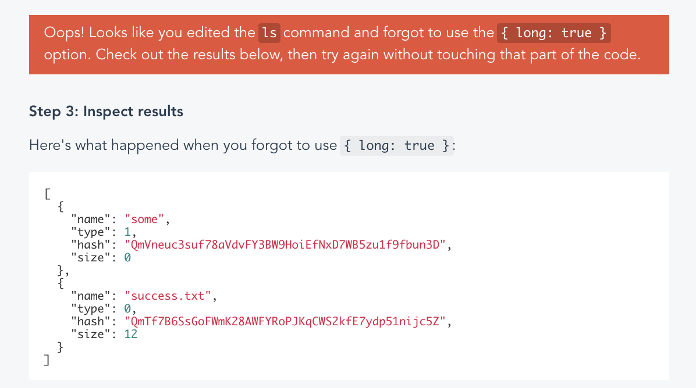


### Submit a pull request

Ready to submit your new tutorial for feedback?

Before submitting new content, please make sure to run `npm run lint`, as a pull request will be rejected if there are any linting errors reported. (New to linting? It's the technical equivalent of grammar- and spell-checking, and will flag any programming errors, bugs, or stylistic errors in your code.)

Once you've addressed any linting errors, ensure all of your commits have been pushed to your branch, then [submit a pull request](https://help.github.com/en/github/collaborating-with-issues-and-pull-requests/creating-a-pull-request)  on GitHub to merge your branch into our default `code` branch. (If [creating a pull request from a fork](https://help.github.com/en/github/collaborating-with-issues-and-pull-requests/creating-a-pull-request-from-a-fork), please check the box to allow edits from maintainers.)

## Troubleshooting

### Clearing cached data from localStorage

In order to save the user's progress as they work, ProtoSchool uses [localStorage](https://developer.mozilla.org/en-US/docs/Web/API/Window/localStorage) to save cached code and lesson state between visits. This feature works when the user visits the site repeatedly in the same web browser, so long as they aren't using incognito or private mode. Although this solution doesn't work across browsers (a user would see a different history in Chrome than in Firefox, for example), we find that it enables us to provide a nicely customized experience for most users without requiring a login.

On occasion, while developing a lesson, you may want to view the site as though you're a first-time visitor for testing purposes. To do this, you have a few options:
- Open the site in an incognito or private window using your normal web browser
- Open the site in a web browser you haven't used before (Firefox if you normally use Chrome, etc.)
- Clear the localStorage in your main browser by opening the console in your inspector and entering the command `localStorage.clear()`, then refreshing your browser.

Note that your user history on the live website (https://proto.school) is different from that in your local testing environment (localhost), so deleting your cache in the development environment won't affect your history on the live site.

### Renaming a tutorial after it has been published

1. In the `src/static/tutorials.json` file, rename `title` to the new desired title.
1. Add old tutorial `url` value to the `redirectUrls` attribute. (e.g. `"redirectUrls": ["old-tutorial-short-title"]`)
1. Update `url` with the new name.
1. Rename folder `src/tutorials/xxxx-old-tutorial-short-title` to the new url. (e.g. `src/tutorials/xxxx-new-tutorial-short-title`)

That's it! Next time you run ProtoSchool the tutorial should be renamed and users will still have access to the status of their lesson progress. If a user tries to access the old URL for your tutorial or one of its lessons, they'll be redirected to the tutorial landing page at its new URL.

### Text of lesson or challenge not displayed

If you're unable to see the text of your lesson or challenge when previewing the website, one of your Markdown files (*.md or *-challenge.md) may not be loading correctly. You can use the `DEBUG=true` option to get warnings in the console. To enable it, run:

```sh
DEBUG=true npm start
```

Check your browser dev tools for warning logs.

## Detailed Docs

### Lesson file

Lesson files should be put in the folder `src/tutorials/xxxx-tutorial-short-title` with the appropriate lesson number used as the filename (e.g., `01.js`).

**Exportable properties**:

The properties exported from this file depend on the lesson type, as follows:

- For **code challenges** only (with and without file upload):
  - `validate(result, ipfs)`: Function - mandatory - _the validation code used to evaluate the user's code submission_ ([detailed docs](#validate-the-users-submitted-code))
  - `solution`: String - mandatory - _the suggested solution to the code challenge, visible to the user on demand_ ([detailed docs](#provide-the-simplest-solution-to-your-challenge))
  - `code`: String - optional - _the starting code for the challenge (though technically optional because a default is available, you will almost always need to provide this)_ ([detailed docs](#provide-the-starting-code-for-your-challenge))
  - `options`: Object - optional
      - `overrideErrors`: Boolean - default is `false` - _allows customized replacement of IPFS-generated errors with more user-friendly messages_ ([detailed docs](#override-external-error-messages-optional))
      - `createTestFile`: Boolean - default is `false` - _before validation, runs `createFile` in `Lesson.vue` to create a sample file the user can read from (see function for details)_
      - `createTestTree`: Boolean - default is `false` - _before validation, runs `createTree` in `Lesson.vue` to create a sample directory the user can read from - (see function for details)_

- For **multiple-choice quizzes** only:
  - `question`: String - mandatory - _the question to be answered by the user_ ([detailed docs](#create-multiple-choice-quizzes-in-your-javascript-file-skip-for-coding-challenges-and-text-only-lessons))
  - `choices`: Array - mandatory - _the potential answers between which the user must choose_ ([detailed docs](#create-multiple-choice-quizzes-in-your-javascript-file-skip-for-coding-challenges-and-text-only-lessons))

### `utils` module

This module is a set of utils designed to be re-used across the validation code of different tutorials.

#### `utils.format`

- `ipfsObject(object)`: formats an IPFS object to be ready to print in the output UI, for example, formatting a `cid` object into a string.

Example:

```js
return {
  success: 'Success! You did it!',
  logDesc: "Here is the result.",
  log: utils.format.ipfsObject(result)
}
```

Without special formatting, the `result` object would be displayed like this:

```
{
  "path": "QmQNcG7yJPWGuAoM2jmF78t6GTdNSmcuXr2c18SfJ4tVJQ",
  "cid": {
    "codec": "dag-pb",
    "version": 0,
    "hash": {
      "type": "Buffer",
      "data": [
        18,
        32,
        30,
        55,
        196,
        121,
        86,
        111,
        123,
        58,
        178,
        22,
        159,
        46,
        21,
        223,
        12,
        1,
        37
      ]
    }
  },
  "size": 40391,
  "mode": 420
}
```

By contrast, the formatted object is displayed like this:

```json
{
  "path": "QmRz7dg5FcbESqbbzxMVksyHfqJwqibcKZULUoichwwmsu",
  "cid": "CID('QmRz7dg5FcbESqbbzxMVksyHfqJwqibcKZULUoichwwmsu')",
  "size": 778308,
  "mode": 420
}
```

#### `utils.ipfs`

- `errorCodes`: set of error codes from `js-ipfs`
  - `ERR_MORE_THAN_ONE_ROOT`
You can reference these error codes in your validation code when you'd like to override them with messages more specific to the context of your lesson. For example:

```js
if (result.code === utils.ipfs.errorCodes.ERR_MORE_THAN_ONE_ROOT) {
  return {
    fail: 'Some error message specific to this edge case.'
  }
}
```
IPFS error codes not listed above are not currently included in this feature, but can be added to our codebase as needed. If the error codes you need are not available, you can add them to the file [tutorials/utils/ipfs.js](./src/tutorials/utils/ipfs.js) and to this documentation.


#### `utils.validationMessages`

These validation messages can be used to avoid re-writing the same feedback messages across tutorials and lessons.

- `SUCCESS`: when the user has successfully completed the code challenge
  - Example: `Success! You did it!`
- `NO_RESULT`: to show when the user forgets to return a result
  - Example: `Oops! You forgot to return a result :(`
- `VALUE_IS_ASYNC_ITERABLE_ALL`: when the user returned an AsyncIterable and forgot to use the `all` function on the result
  - Example: `The returned value is an Async Iterable. Did you forget to put all the results together using either for await...of or with all?`
- `VALUE_IS_ASYNC_ITERABLE_TOBUFFER`: when the user returned an AsyncIterable and forgot to use the `toBuffer` function on the result
  - Example: `The returned value is an Async Iterable. Did you forget to concatenate all the data using toBuffer?`

While these codes provide an easy shorthand, you'll still need to provide the logic that determines when a particular validation message should be displayed for each lesson. For example:

```js
import utils from '../utils'

const validate = async (result, ipfs) => {
  if (!result) {
    return {
      fail: utils.validationMessages.NO_RESULT
    }
  }
}
```


#### `utils.validators`

Validators that can be re-used across tutorials and lessons.

- `isAsyncIterable(result)`: tests whether the result is an AsyncIterable or not

While you can use these shorthands to test for certain conditions, you'll still need to specify what validation message should be displayed as a result. In the example below, a validator is used in combination with a validation message.
```js
if (utils.validators.isAsyncIterable(result)) {
  return {
    fail: utils.validationMessages.VALUE_IS_ASYNC_ITERABLE_ALL
  }
}
```


## License

ProtoSchool is licensed under the Apache-2.0 and MIT licenses. See [LICENSE.md](https://github.com/protoschool/protoschool.github.io/blob/master/LICENSE.md) for further detail.
